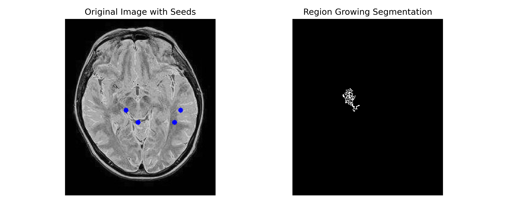

# Image Segmentation Techniques in Python – EC7212 Assignment

This repository contains implementations of two fundamental image segmentation techniques in Python using OpenCV and NumPy.

---

## Objectives

Python programs perform the following image processing tasks:

### Image Segmentation Techniques
1. **Otsu Thresholding with Gaussian Noise**  
   Add noise to a simple 3-class image and segment using Otsu’s method. 
   This technique enhances a synthetic grayscale image with Gaussian noise to simulate real-world imperfections. Otsu's algorithm is then applied to automatically determine the optimal threshold for separating foreground and background. The result demonstrates robust binarization even in noisy conditions. 
2. **Region Growing Segmentation**  
   Starting from a user-defined seed pixel, this method recursively expands the segmented region by evaluating pixel intensity similarity within a predefined threshold. It effectively segments objects based on local homogeneity, making it suitable for separating regions with subtle variations. The implementation is efficient and well-suited for grayscale object-based segmentation tasks.


---

## Project Structure

```
EC7212-Computer-Vision-and-Image-Processing-Assignment_02/
├── input/                        # Input image
│   └── img1.png
├── output/                       # Output results
│   ├── otsu_threshold.png
│   ├── otsu_display.png
│   ├── region_growing_output.png
│   └── region_growing_display.png
├── Q1__otsu_threshold.py         # Otsu with Gaussian Noise (Q1)
├── Q2__region_growing.py         # Region Growing Script (Q2)
├── README.md                     # Project documentation
└── requirements.txt              # Dependencies
```

---

## Getting Started

### ✅ 1.Prerequisites

- Python 3.7+
- OpenCV
- NumPy
- Matplotlib

### ✅ 2.Setup Instructions

- Clone the repository:

```bash
git clone https://github.com/HashiniPrabuddhika/EC7212-Computer-Vision-and-Image-Processing-Assignment_02.git
cd EC7212-Computer-Vision-and-Image-Processing-Assignment_02
```

### ✅ 3.Create and activate a virtual environment:
```bash
# For Windows
python -m venv venv
venv\Scripts\activate

# For macOS/Linux
python3 -m venv venv
source venv/bin/activate
Install the dependencies:
# Install dependencies
pip install -r requirements.txt
```

### ✅ 4.Running the Project Execute the Commands to run 

```bash
python otsu_threshold.py       # For Q1 - Otsu Threshold
python region_growing.py       # For Q2 - Region Growing
```
Process the img1.png and save all visual results in the output/ folder.

---

## Results and Explanations

### Otsu Thresholding
In this task, Gaussian noise is added to a synthetic grayscale image containing distinct objects and a background. Otsu’s method is then used to automatically determine the optimal threshold value that best separates the noisy foreground from the background. The resulting binary segmentation is saved in otsu_threshold.png, with a side-by-side visualization in otsu_display.png.

Result:


### Region Growing
This technique begins from a predefined seed point within the object of interest and expands the segmented area by recursively including neighboring pixels that fall within a specified intensity range. It effectively captures homogeneous regions based on local similarity, making it suitable for object-based segmentation. The segmented output is saved as region_growing_output.png, and a visual comparison is provided in region_growing_display.png.

Result:


---

## Output Preview

| Task                    | Output File                   |
|-------------------------|-------------------------------|
| Otsu Thresholding       | `otsu_threshold.png`          |
| Otsu Visualization      | `otsu_display.png`            |
| Region Growing Output   | `region_growing_output.png`   |
| Region Growing Display  | `region_growing_display.png`  |

---
